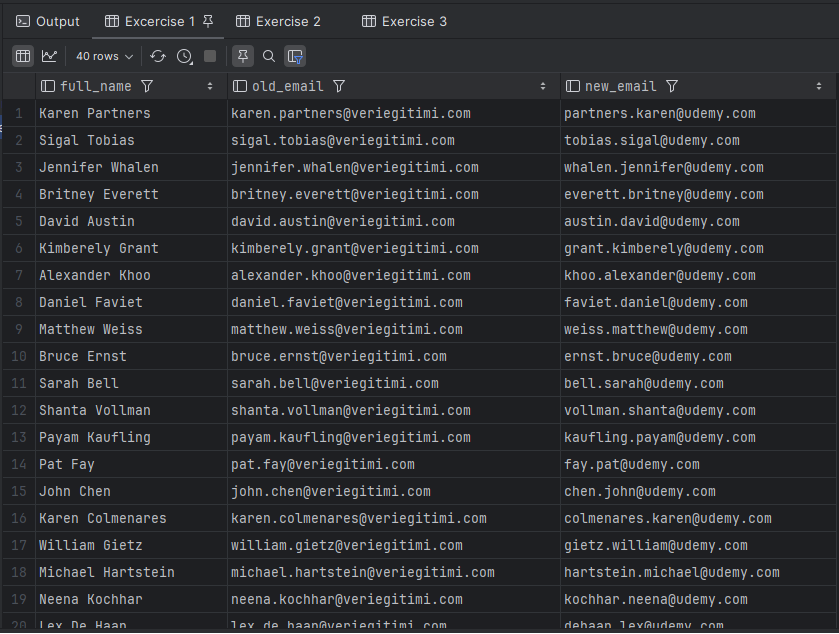
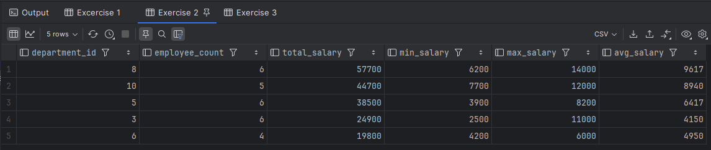
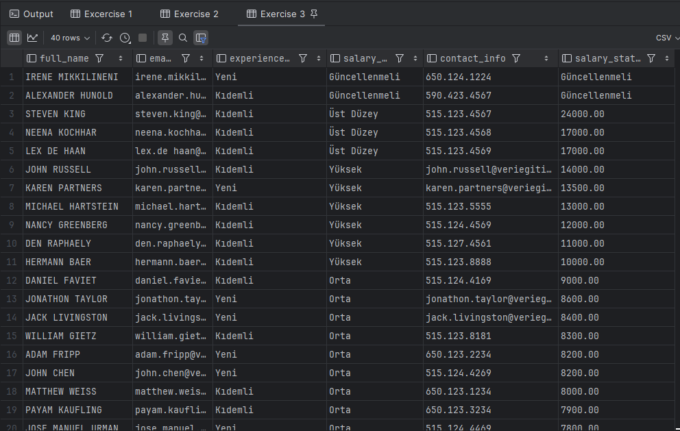
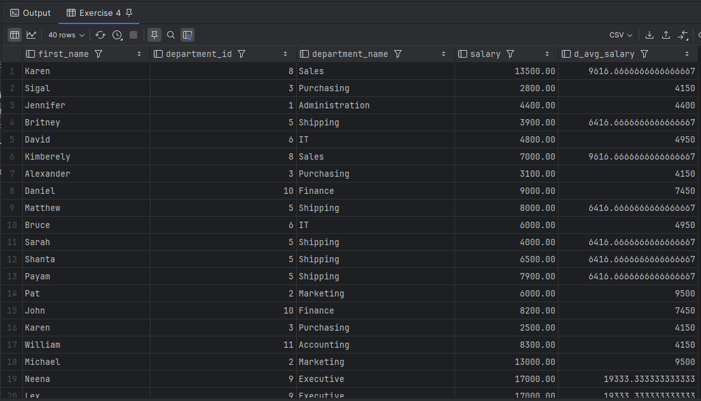
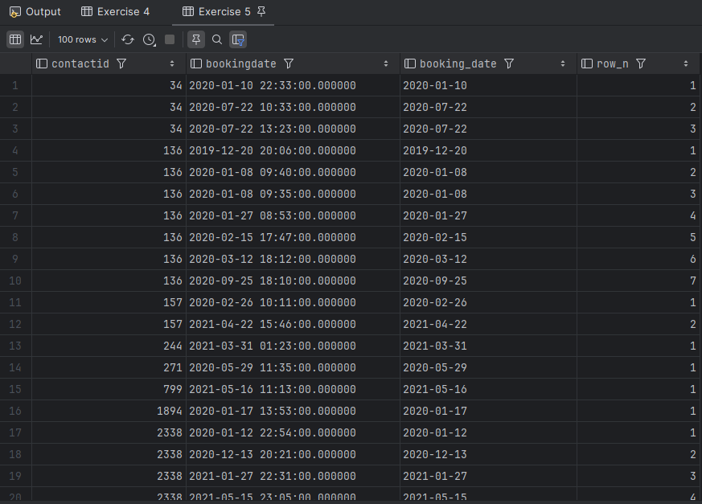

# SQL Coding Exercises – Udemy Course

This repository contains five SQL exercises based on real-world business scenarios. The exercises were completed as part of the Udemy course:

> 🎓 **Industry-Focused SQL Training from Scratch**  
> Instructor: **Nafiz Altay**

The datasets used are based on fictional business tables such as `hr.employees` and `travels.bookings`, and the solutions are written in **PostgreSQL** syntax.

---

## 📘 Exercises Overview

### ✅ 1. Email Address Format Conversion

- **Scenario**: Your company has been acquired by Udemy. You are asked to generate new email addresses in the format `lastname.firstname@udemy.com`, removing any spaces in names.
- **Skills Used**: `CONCAT`, `LOWER`, `REPLACE`, `AS`

📌 Output Sample:  

---

### ✅ 2. Departmental Salary Analysis

- **Scenario**: Management wants to examine the salary distribution by department and identify high-budget departments. Only departments with more than 3 employees are included.
- **Skills Used**: `COUNT`, `SUM`, `MIN`, `MAX`, `ROUND`, `GROUP BY`, `HAVING`, `ORDER BY`, `NULLIF`

📌 Output Sample:  

---

### ✅ 3. Employee Profile Report

- **Scenario**: As the company's HR Analyst, you're asked to prepare a profile report ahead of the year-end performance review.
- **Skills Used**: `CASE`, `CONCAT`, `UPPER`, `COALESCE`, `NULLIF`, `ORDER BY`, `CAST`

📌 Output Sample:  

---

### ✅ 4. Departmental Average Salary Per Employee

- **Scenario**: You need to return each employee’s information along with the average salary of their respective department.
- **Skills Used**: `CTE`, `JOIN`, `AVG`, `LEFT JOIN`

📌 Output Sample:  

---

### ✅ 5. Customer Order History

- **Scenario**: List all orders for each customer, sorted by booking date.
- **Skills Used**: `ROW_NUMBER()`, `PARTITION BY`, `ORDER BY`, `TO_CHAR`, `LIMIT`

📌 Output Sample:  

---

## 💾 Files Included

- `Coding Exercises.sql`: Contains all 5 SQL queries with comments and explanations.
- `exercise1_output.png` to `exercise5_output.png`: Visual representations of query results.

---

## 📌 Note

These exercises were created for educational purposes and are inspired by business scenarios presented in the SQL course mentioned above.
